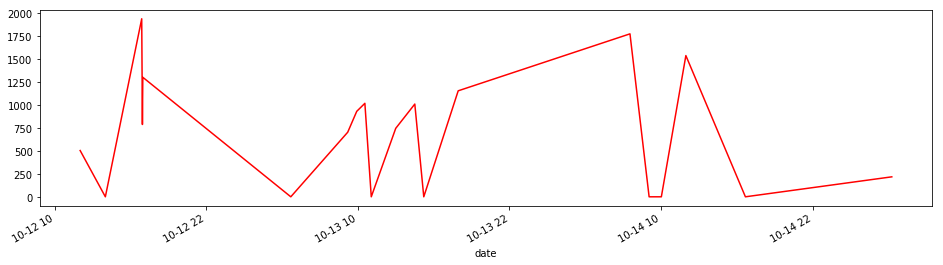
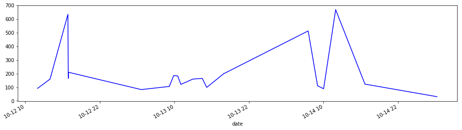
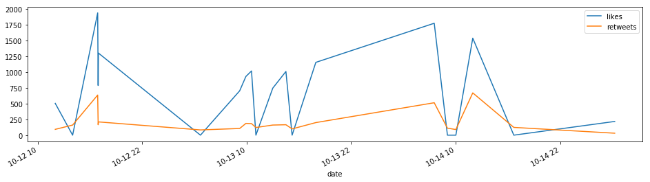

```python
from tweepy import API
from tweepy import Cursor
from tweepy.streaming import StreamListener
from tweepy import OAuthHandler
from tweepy import Stream
import numpy as np
import pandas as pd

import twitter_credentials
```


```python
#### TWITTER AUTHENTICATOR ####
class TwitterAuthenticator():
    
    def authenticate_twitter_app(self):
        auth = OAuthHandler(twitter_credentials.CONSUMER_KEY, twitter_credentials.CONSUMER_SECRET)
        auth.set_access_token(twitter_credentials.ACCESS_TOKEN, twitter_credentials.ACCESS_TOKEN_SECRET)
        return auth
```


```python
#### TWITTER STREAM LISTENER ####
class TwitterListener(StreamListener):
    """
    This is a basic listener just prints recieved tweets
    """
    def __init__(self, fetched_tweets_filename):
        self.fetched_tweets_filename = fetched_tweets_filename
        
    def on_data(self, data):
        try:
            with open(self.fetched_tweets_filename, 'a') as tf:
                tf.write(data)
            return True
        except BaseException as e:
            print('Error on data %s' % str(e))
        return True
    
    def on_error(self, status):
        if status == 420:
            # Returnig False on data_method in case rate limit occurs
            return False
        print(status)
```


```python
#### TWITTER STREAMER ####
class TwitterStreamer():
    """
    class for sreaming and processing live tweets 
    """
    def __init__(self):
        self.twitter_authenticator = TwitterAuthenticator()
        
    def stream_tweets(self, fetched_tweets_filename, hash_tag_list):
        # This handles Twitter authentication and the connection to Twitter streaming API.
        listener = TwitterListener(fetched_tweets_filename)
        auth = self.twitter_authenticator.authenticate_twitter_app()
        stream = Stream(auth, listener)
        
        # This line filter Twitter streams to capture data by the keywords
        stream.filter(track=hash_tag_list)
```


```python
#### TWITTER CLIENT ####
class TwitterClient():
    
    def __init__(self, twitter_user=None):
        self.auth = TwitterAuthenticator().authenticate_twitter_app()
        self.twitter_client = API(self.auth)
        self.twitter_user = twitter_user
        
    def get_twitter_client_api(self):
        return self.twitter_client
    
    def get_user_timeline_tweets(self, num_tweets):
        tweets = []
        for tweet in Cursor(self.twitter_client.user_timeline, id=self.twitter_user).items(num_tweets):
            tweets.append(tweet)
        return tweets
    
    def get_friend_list(self, num_friends):
        friends_list = []
        for friend in Cursor(self.twitter_client.friends, id=self.twitter_user).items(num_friends):
            friends_list.append(friend)
        return friends_list
    
    def get_home_timeline_tweets(self, num_tweets):
        home_timeline_tweets = []
        for tweet in Cursor(self.twitter_client.home_timeline, id=self.twitter_user).items(num_tweets):
            home_timeline_tweets.append(tweet)
        return home_timeline_tweets
```


```python
#### TWEET ANALYZER ####
class TweetAnalyzer():
    """
    Functionality for analyzing and categorizing content from tweets.
    """
    def tweets_to_data_frame(self, tweets):
        df = pd.DataFrame(data=[tweet.text for tweet in tweets], columns=["tweets"])
        
        df['id'] = np.array([tweet.id for tweet in tweets])
        df['len'] = np.array([len(tweet.text) for tweet in tweets])
        df['date'] = np.array([tweet.created_at for tweet in tweets])
        df['source'] = np.array([tweet.source for tweet in tweets])
        df['likes'] = np.array([tweet.favorite_count for tweet in tweets])
        df['retweets'] = np.array([tweet.retweet_count for tweet in tweets])
        return df
```


```python
if __name__ == '__main__':
    twitter_client = TwitterClient()
    tweet_analyzer = TweetAnalyzer()
    
    api = twitter_client.get_twitter_client_api()
    
    tweets = api.user_timeline(screen_name='ncbn', count=20)
    
    #print(dir(tweets[0]))
    df = tweet_analyzer.tweets_to_data_frame(tweets)
    
    print(df)
```

                                                   tweets                   id  \
    0   Held a teleconference with authorities to asse...  1051687992383791105   
    1   RT @AndhraPradeshCM: Govt of AP has announced ...  1051513061088088065   
    2   #CycloneTitli has left many of the lives in de...  1051441900828467201   
    3   RT @AndhraPradeshCM: 64% of the affected PoPs/...  1051412606303592448   
    4   RT @AndhraPradeshCM: తిత్లీ తుపానుతో తీవ్ర ఇబ్...  1051397979041660928   
    5   శ్రీకాకుళం తిత్లీ తుపాను బాధితులను అన్ని రకాలు...  1051375103521345537   
    6   Assured the citizens of Ichchapuram, @srikakul...  1051169824947220480   
    7   RT @AndhraPradeshCM: Following is a detailed r...  1051128684764119040   
    8   తిత్లీ తుపాను ప్రభావిత ప్రాంతాల్లో లక్షల సంఖ్య...  1051117960985800704   
    9   We are taking important measures in order to p...  1051095164511510528   
    10  RT @AndhraPradeshCM: Out of 822 PoPs/servers a...  1051065944213245953   
    11  భౌగోళికంగా తుపాన్ల బారిన పడే రాష్ట్రం మ‌న‌ది. ...  1051058296550055937   
    12  శ్రీకాకుళం, విజయనగరం జిల్లాలో తిత్లీ తుపాను వల...  1051048577928183809   
    13  Aerially surveyed the damage caused by #Cyclon...  1051037805235695616   
    14  RT @AndhraPradeshCM: Following is the detailed...  1050969774887292928   
    15  Assured necessary assistance to farmers as #Cy...  1050792911791673345   
    16  AP govt has mobilized a special team of 1000 o...  1050792448753131520   
    17  Aerially surveyed the regions affected by #Cyc...  1050791614174687232   
    18  RT @AndhraPradeshCM: తిత్లీ తుపానుతో తీవ్ర ఇబ్...  1050748162938302465   
    19  Live from the press conference, @srikakulamgoa...  1050718046673821702   
    
        len                date               source  likes  retweets  
    0   140 2018-10-15 04:15:31  Twitter for Android    217        31  
    1   140 2018-10-14 16:40:24  Twitter for Android      0       123  
    2   140 2018-10-14 11:57:38   Twitter Web Client   1535       669  
    3   140 2018-10-14 10:01:14  Twitter for Android      0        89  
    4   139 2018-10-14 09:03:06  Twitter for Android      0       111  
    5   138 2018-10-14 07:32:12   Twitter Web Client   1771       513  
    6   139 2018-10-13 17:56:30   Twitter Web Client   1152       199  
    7   140 2018-10-13 15:13:02  Twitter for Android      0        99  
    8   139 2018-10-13 14:30:25   Twitter Web Client   1008       165  
    9   139 2018-10-13 12:59:50   Twitter Web Client    744       160  
    10  140 2018-10-13 11:03:43  Twitter for Android      0       121  
    11  138 2018-10-13 10:33:20   Twitter Web Client   1016       183  
    12  140 2018-10-13 09:54:43   Twitter Web Client    929       186  
    13  109 2018-10-13 09:11:54  Twitter for Android    702       106  
    14  140 2018-10-13 04:41:35   Twitter for iPhone      0        83  
    15  144 2018-10-12 16:58:47   Twitter Web Client   1299       210  
    16  140 2018-10-12 16:56:57   Twitter Web Client    786       165  
    17  140 2018-10-12 16:53:38   Twitter Web Client   1935       635  
    18  139 2018-10-12 14:00:58  Twitter for Android      0       160  
    19   71 2018-10-12 12:01:18            Periscope    503        92  
    


```python
df['likes'].max()
```


    1935


```python
df['likes'].mean()
```


    679.85


```python
df.likes.mean()
```


    679.85


```python
import matplotlib.pyplot as plt
# Time Series
time_likes = pd.Series(data=df['likes'].values, index=df['date'])
time_likes.plot(figsize=(16, 4), color='r')
plt.show()
```





```python
time_tweets = pd.Series(data=df['retweets'].values, index=df['date'])
time_tweets.plot(figsize=(16, 4), color='blue')
plt.show()
```





```python
# Plotting in a single graph

time_likes.plot(figsize=(16, 4), label = 'likes')
time_tweets.plot(figsize=(16, 4), label = 'retweets')
plt.legend()
plt.show()
```




